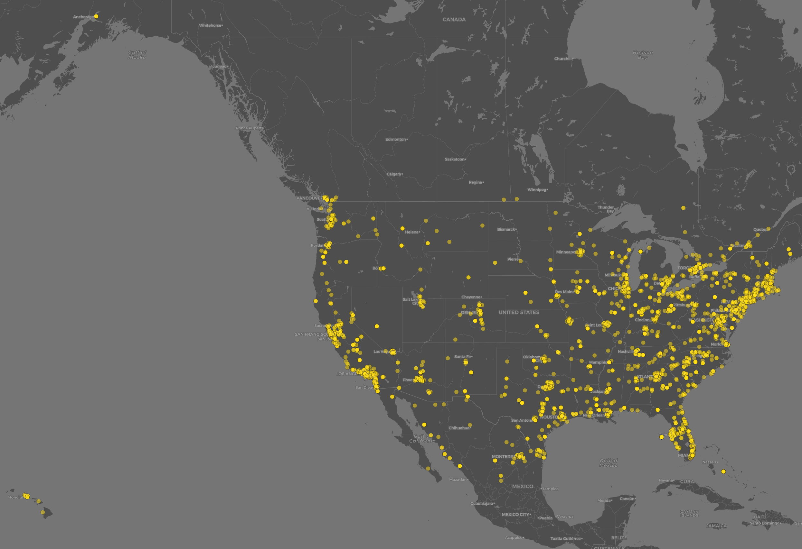

# catharinageotagged.github.io

  
## The Distribution of People's Perception on Social Distancing in the United States
### :newspaper: Background
The aim of this project is to visualize the spatial distribution of peope's perceptions through social media specifically Twitter on ***social distancing*** as the response to COVID-19 in the United States. It is believed that social media is an effective democratizing force that has great impacts on future decision making **[1]**. Social distancing is chosen as the key theme and not ***physical distancing*** based on the assumption that social distancing became more popular due to public criticsm over the UN-World Health Organization's improper use of this term in recommending measure in handling COVID-19 to the world. The later term was approved and adopted by WHO, proving social media's power in enforcing a change **[2]**. United States was chosen as the location of the data crawling because it is the world's leading country based on number of Twitter users in 2020 **[3]** and COVID-19 cases **[4]**. These two facts could provide significant number of tweet data in regards with social distancing that is highly associated with the pandemic. On April 19, 2020, the U.S.' Centers for Disease Control and Prevention (CDC) reported that there have been 720,630 confirmed cases and 37,202 deaths in the United States where New York state was the epicentrum **[5]**. The CDC's report in the provided link, however, will continuously change with accordance to their updates which possibly shows a trend of increase in COVID-19 cases .
 
### :hammer: Method
The QGIS map was produced based on geo-tagged tweet data gathering using API-based crawler. The open source web application **`Juypiter Notebook`** integrated with **`Python`** was utilized to write and run the live codes and perform data crawling.**`Binder`** program was used to allow the interaction with the notebook on a serve in live environment. The online tweet data were collected on April 20, 2020 with 5 minute time duration. The topic ***social distancing*** served as the keyword for filtering the tweet data, the ***Contiguous US, Alaska, and Hawaii*** were selected as the data locations, and the specific user **Twitter ID 2211149702** became the source for tweets streaming. There are ***5,280 tweet data*** that were successfully harvested in this API-based crawling process.
 
### :bulb: Analysis
There are two interpretations that can be drawn from the map.
- ***First***, the orange circles represents how the geo-tagged tweet data about social distancing are distributed unevenly throughout the United States. When compared to the U.S. CDC's database **[6]**, the COVID-19 cases distributions map is inline with the tweet data distribution on this map. The higher the COVID-19 cases were concentrated in the U.S., the higher people's responses to social distancing in those areas. This suggests that people's perceptions on social distancing in the U.S. is strongly associated with the COVID-19 pandemic.
- ***Second***, the tweet data are more dense in areas along the U.S.territorial boundaries with concentration on the East Coast, and relatively disappear as going inward.The tweet data are more dense in the East Coast rather than other parts of U.S. mainly because its regions are highly affected by COVID-19, for instance New York State which is the epicentrum of the pandemic. Similar trend of tweet data accummulations also occurs in New York's neighbors such as New Jersey, Washington, D.C., Philadelphia, and Maryland. In general, the social distancing following the COVID-19 pandemic highly influenced people's perceptions and public discussions via social media Twittter in the East Coast whose regions are ranked as the most affected by the COVID-19 to this date. 

### References  
[1] Kay, S., Zhao B., Sui D., 2015, ***Can Social Media Clean The Air? A Case Study of the Air Pollution Problem in Chinese Cities***, Journal of the Professional Geographer: Taylor and Francis Group, LLC.  
[2] US CDC's COVID-19 cases data: <https://www.cdc.gov/coronavirus/2019-ncov/cases-updates/cases-in-us.html#anchor_1586784349>  
[3] Statista's Data of Twitter Users: <https://www.statista.com/statistics/242606/number-of-active-twitter-users-in-selected-countries/>  
[4] United Nation's World Health Organization: Coronavirus (COVID-19):<https://covid19.who.int/> 
[5] Social Distancing: <https://www.cdc.gov/coronavirus/2019-ncov/cases-updates/cases-in-us.html#anchor_1586784349>  
[6] US CDC's COVID-19 cases map: <https://www.cdc.gov/coronavirus/2019-ncov/cases-updates/cases-in-us.html>
